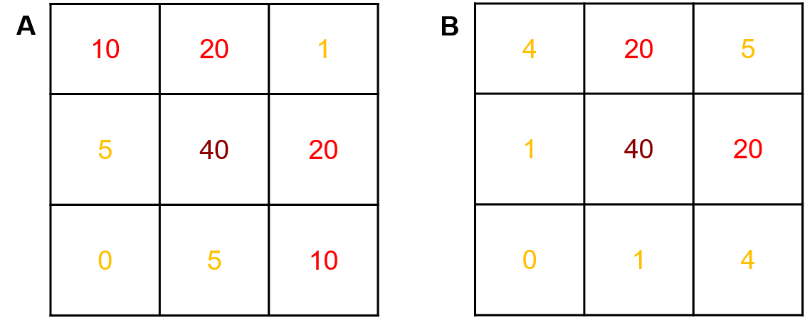

# Introduction and Background

<!-- Un exemple d'article amb una estructura semblant: 
https://journals.plos.org/plosone/article?id=10.1371/journal.pone.0118621#sec002
-->
## Introduction to methylation
Epigenetic marks modulate gene expression without affecting the DNA nucleotide sequence. These potentially heritable changes are, for example, DNA methylation or histone acetylation (@Berger2009). DNA methylation is the most studied epigenetic process in humans. The process is based on the addition of a methyl group, mostly in CpG dinucleotides. The CpG dinucleotides tend to group in areas of less than 500kb and with higher than 55\% C and G content, these regions are named islands; further from the island the region is called shore; and further from the shore it is called shelf. More than 60\% of promoter regions are associated with CpG islands (@Saxonov2006) and the methylation of these is linked to gene silencing and gene expression inhibition.
DNA methylation has been linked to the regulation of numerous cellular processes, including embryonic development, or X-chromosome inactivation and preservation of chromosome stability among others. DNA methylation has also been observed in autoimmune diseases, metabolic disorders, neurological disorders, and other processes that despite being natural they are debilitating, like ageing for example; and it can also be correlated with drug or treatment response (@Reik2007; @Portela2010; @Feil2012; @Benayoun2015). 
Most research on this area has been, however, focused on tumor repressor genes, which are often silenced in cancer cells due to hypermethylation. This is an important mechanism of gene silencing during tumor progression (@Jones2002).  On the contrary, a general level of hypomethylation has been observed in human tumors (@Feinberg1983); therefore, hypomethylation is a useful mechanism to distinguish genes of some human cancers from their normal counterparts.  
In the human genome, about 80% of cytosines in the 56 million CpG sites are methylated to 5-methylcytosines. The methylation pattern of DNA is highly variable among cells types and developmental stages and influenced by disease processes and genetic factors. The relationship between gene expression and methylation has been associated with cancer and extensively studied, therefore it has produced fruitful results (@Yang2014).

## Analysis of genes regulatated by methylation
With the abundance of emerging evidence indicating the important role of DNA methylation in common diseases, researchers have attempted to use DNA methylation as a biomarker to identify epigenetic changes that are associated with disease status. While the genetic events that drive the tumorigenic process are relatively well characterized for colorectal cancer, the epigenetic events and their impact on the transcriptional reprogramming observed in colorectal tumors have not been extensively characterized. Although recent genome-wide studies have analyzed the genomic distribution of hypermethylated CpGs in a small number of colorectal tumors (@McInnes2017; @Dong2019; @Orjuela2020), a detailed analysis of the subset of these events that are important for gene expression regulation is currently lacking. 
Just as gene expression microarrays accelerated and revolutionized the study of transcriptional regulation, rapidly improving technologies are increasingly enabling researchers to assess locus-specific DNA methylation on a genome-wide scale. Recently, various high-throughput approaches based on bisulfite conversion, that combined with next generation sequencing, have been developed and applied for the genome wide analysis of DNA methylation. These methods provide single base pair resolution, quantitative DNA methylation data with genome wide coverage.
There are various experimental types of methylation assays, but overall, methylation levels can be represented in one of three types: discrete, continuous or categorical. Therefore, methylation can be quantified by directly using read count information, ratio data (which may lose biological variability) or both. Once the DNA samples are processed, an important issue to be considered is the influence of the statistical analysis on the accuracy of the genomic methylation level estimation from bisulfite sequencing data. The accuracy of the statistical approach to methylation quantification increases with the sequencing depth of the particular cytosine residue (@Zhang2010).  However, there are regression and neighboring analysis techniques that can counteract the lack of sequence depth in a particular CpG (@Wreczycka2017). 

### Existing methods and analyses
The association between gene expression and DNA methylation in the CpG islands in particular has been long studied. As a result, mostly negative correlations have been found to relate to cancer driven mechanisms (@Sadikovic2008). Nevertheless, this inverse relationship between DNA methylation, of the first intron in particular, and gene expression is a broad mechanism to down-regulate gene expression and it is found in numerous processes, organisms and tissues (@Anastasiadi2018).
There have been various studies analysing this correlation using diverse approaches. For example, Massie et al. (2017) looked at the relationship between gene expression and DNA methylation at the probe level rather than at the gene level. They narrowed a list of genes regulated by methylation that were identified in more than 3 out of 17 studies (@Massie2017). Another study analysed the TCGA database to identify patterns in DNA CpG methylation and gene expression and tumor status. They found that the association involved a reduced number of genes linked to cancer than originally anticipated (around the hundreds) and that not all correlations were negative (@Long2017). Another recent paper reported two different models for analysis of DNA methylation and regulation of gene expression, one for negatively correlated genes and one for positively correlated genes (@Klett2018).  They used expression (GSE106582) and methylation datasets  (GSE101764) containing 194 samples, 77 tumors and 117 of the mucose. By random forest analysis they were able to classify genes into cancer related and not related. Still methodologies to find tune classification into cancer/disease related and not cancer/disease related are still needed. A previously developed method was the selection of genes with an L-shape association between the expression and the methylation datasets (@Sanchez-Pla2017). In this research, they focused on the CMI (Conditional Mutual Information) metric and on another method based on spline regression. They observed that the first method would detect L-shaped genes more accurately in big datasets. On the other hand, the splines clustering was not size dependent, but it would yield a smaller number of samples. Other research exists that aimed to identify genes regulated by methylation according to the expression/methylation patterns; however, they only use a particular methodology like the CMI (@Liu2012) with positive results. A paper focused on the identification of genes regulated by methylation through unsupervised clustering techniques to identify CRC subtypes was able to confirm existing subtypes (@Barat2015).There has been other work that focused on the development of platforms for the identification of genes regulated by methylation. One of these packages is MEXPRESS (@Koch2019). This package has a web interface that allows the user to visualize expression and methylation data from genes in the TCGA data. The visualization collocates for each selected gene, CpG islands, with transcripts expression together with other clinical values such as gender and age. The tool also generates p-values in relation to the variables specified. Another one of these packages is MethylMix, based in R (@Cedoz2018). The algorithm is based on a beta mixture model that identifies methylation states and compares them with what they call normal conditions to find hypo- and hyper-methylated genes. They developed a new statistic coefficient, the Differential Methylation value or DM-value which is defined as the difference of a methylation state with the normal methylation state. Then, they correlate that coefficient with gene expression data to characterize the association between the methylation level and gene expression. ELMER (https://bioconductor.org/packages/release/bioc/html/ELMER.html, @Silva2018) is another R package that performs an integrative analysis of methylation and gene expression using the difference of methylation between control and deseased samples to select differentially methylated probes. These selected probes are then aligned to each downstream gene targets; and finally, the predicted enhancers are integrated to expression data and a selection is generated by negative correlation analysis (either supervised or unsupervised). There is also a web based tool that analyses methylated genes based on TCGA data, called MethHC (http://methhc.mbc.nctu.edu.tw/php/search.php?opt=gene, @Huang2021). This database has an analysis tool that provides gene-specific analysis for various diseases, and the information is displayed as a comparison between diseased and normal (non-diseased) conditions; list of highest and lowest methylated (hyper and hypo) genes; as well as correlations between expression and methylation. In this, methylation is considered as a binary value (0,1).
There have been other methodologies used to identify methylated genes associated with cancer is through text mining analysis, as in the PubMeth database (www.pubmeth.org, @Ongenaert2007). In this, they identified 5000 genes from 1000 publications.
However, high-throughput methodologies that offer an impartial approach to the identification of genes regulated by methylation still need further development and fine-tuning. Here we present such a methodology to select, out of a gene expression and DNA methylation subsets, those genes that not only present a negative correlation, but also have a particular "L-shape" and are therefore potentially regulated by methylation. The L-shaped heuristic method developed to identify genes regulated by methylation was tested and tuned for experimental expression and methylation paired datasets previously normalized.

# Materials and Methods

As previously described, there are various approaches to selecting genes based on the relationship between methylation levels and gene expression;however, none of them are completely satisfactory. 

In this section we present the method we have developed to select genes in which the pattern of the relationship is "L-shaped". In fact, taking biological processes into account, this is a very common and very reasonably expected pattern when genes are regulated by methylation. Furthermore, as we will see later, it is not only important but can be partially missed by "naïve" methods such as negative correlation, which increases the interest of our proposed methodology.

## Rationale of the approach

After trying different approaches to detect L-shapes, one often comes back to an intuïtive idea: If we are looking for genes whose expression can take any value when methylation is low, and tends to decrease as methylation increases one should observe that points in the methylation-expression scatterplot tend to be scattered near the vertical and horizontal positive axes showing an L-shape. If this does not happen genes can be found anywhere in the scatterplot and we can call it a non-L-shape. That is:

- The more the points cluster near the  vertical and horizontal axes, the more L-shaped can be considered the scatterplot.
- The more the points move away from the axes, the least L-shaped the scatterplot is.

This representation of differing scatterplot patterns can be observed in two real but non-identified genes from a colorectal cancer study (Fig. 1).

## An algorithm to select L-shape scatterplots

Assuming that genes potentially regulated by methylation can be selected from between L-shaped expression--methylation scatterplots, finding a way to separate L-shape from non-L shape ones is a reasonable first step. It could be argued that this could be done manually, but given the high number of -possibly highly variable- figures to be searched, an algorithm to automate this process is a much better option. 

The algorithm can be developed starting from the intuitive distinction between L and non-L discussed above and making it more explicit as follows:

\begin{enumerate}
\item Given a scatterplot methylation-expression $X$, overlay a $k\times m$ grid on it so that each point is assigned to one and only one of the grid's cell. Usually $k=m=3$ so this will be the values used in the following.
\item Classify the scatterplot as \textbf{``L'' or ``non-L''} based on a small set of conditions:
\begin{enumerate}
  \item There must be a \emph{minimum} number of points in the upper-left (cell (1,1)) and lower right (cell (3,3)) corners of the grid.
  \item There must be a \emph{maximum} number of points in the upper right (cell (1,3)) because points there mean hypermethylation and hyperexpression which is the opposite of what we are looking for.
  \item We will usually \emph{not require to have a minimum of points in cell (3,1)} unless we are really willing to have an L-shape (in our setting we will also be happy tho recover diagonals, which also reflect a negative correlation!).
\end{enumerate}
\item Score points on each subgrid in such a way that
\begin{enumerate}
	\item Points in permitted regions (left-outer margin, i.e. cells: (1,1), (2,2), (3,1), (3,2), (3,3)) score positively if the scatterplot has been classified as L or zero if it has been classified as non-L.
	\item Points in non-desired regions (outer band. i.e. cells (1,2), (1,3), (2,3)) score negatively in all cases.
	\item Some regions may be declared neutral and not-score, such as cell (2,2).
\end{enumerate}
\item Use cross-validation to tune scoring parameters (\textit{if a set of positive and negative L-shaped genes is available}). 
\end{enumerate}

The previous scheme can be summarized using the following equation.
\begin{equation}
S(X) = W_L \circ X \times \mathbf{1}_L(X) + W_{L^C} \circ X \times \mathbf{1}_{L^c}(X),
\end{equation}
where
\begin{itemize}
\item ${X}$ is the matrix of \emph{counts}, i.e. the number of counts in each cell of the grid,
\item ${W_L}$ is the matrix of scores per cell and point \emph{if the scatterplot has been classified as $L$},
\item ${W_{L^c}}$ is the matrix of scores per cell and point \emph{if the scatterplot has been classified as non-$L$ ($L^c$)},
\end{itemize}
and $\circ$ represents the hadamard product of the two matrices $W_{L/L^c}$ (i.e. elementwise multiplication of the two matrices) and $\mathbf{1}_{L/L^c}()$ is the indicator function for $L$ or $L^c$.

The fact that the scatterplot is assigned to $L$ or $L^c$ can also be described as the hadamard product of three matrices:
\begin{equation}
\mathbf{1}_L(X) = \bigwedge_{i,j} X \circ C \circ \left( mMP \times \sum_{i,j}x_{ij}\right),
\end{equation}
where 
\begin{itemize}
\item ${X}$ is the matrix of \emph{counts}, i.e. the number of counts in each cell of the grid,
\item $C$ is the matrix of conditions to be verified \emph{if the scatterplot has to be classified as $L$},
\item $mMP$ is the matrix of minimum and Maximum Percentages of points to have in each cell \emph{if the scatterplot has to be classified as $L$},
\item $\circ$ represents the pointwise logical operation which allows that the product of the three cells becomes a logical operation and
\item $\bigwedge_{i,j}$ represents an logical ``AND'' operation of all cells, that is if all cells are TRUE the result is assigned to $L$ and if one fails it is assigned to $L^c$.
\end{itemize}

Fig. 2 shows a graphic representation of this grid approach. 

## Data sources

### TCGA-COAD datasets

The TCGA-COAD are a group of datasets from the colon adenocarcinoma project, which contains data from both the colon and the rectosigmoid junction. It has 452 cases for expression datasets and 451 for methylation. Data was downloaded from the TCGA database (https://www.cancer.gov/about-nci/organization/ccg/research/structural-genomics/tcga). The final dataset used for analysis with the heuristic classification method after matching both cases and genes for expression and methylation had 223 patient samples and 11788 genes in common.

### CRC experimental reserach datasets

An experimental dataset was used from the study (Diego Arango article), which contained a total of 30 samples and 11359 genes.

### Synthetic dataset generation for the simulation studies

The R package `simstudy`  was used to create 4 artificial datasets by using the splines method (https://cran.r-project.org/web/packages/simstudy/simstudy.pdf).  The package allows for designing data points on a pre-defined spline, in which knots, limits and dispersion can be tuned. The splines were generated based on a fixed X variable representing the methylation values. The artificial datasets contained a total of 1000 genes, and the data points were developed based on 2 parameters with 2 levels each. The first parameter was the number of samples and the second the % of genes with an expression by methylation scatterplot or spline following an L-shape (potentially regulated by methylation)  that a sample would contain. The number of samples or cases considered was of 50 and 1000, and the % of L-shaped genes  in each dataset was 1% and 10%. Additionally, the shape of the negative genes (potentially not regulated by methylation) was also pre-defined and classified into 5 different scatterplot patterns (Fig. 3). The percentage of genes in each category equaled to 1/3 prior subtraction of the L-shaped genes. These artificial genes were generated based on real gene patterns observed from previous analyses with TCGA and experimental CRC data (Fig. 4). 

# Results

## Presentation of method parameters, input and output

### Manin functions and parameters

The scoreGenesMat is a wrapper function that generates and scores any given scatterplot using a binary and a numeric schemes on a row-wise basis
Parameters required to run the analysis with the scoreGenesMat function:

* **mets** Matrix of methylation values 
* **expres** Matrix of expression values
* **aReqPercentsMat** Matrix of minimum maximum percentage of counts to have in a given cell
* **aWeightMifL** A matrix of weights to score the previous counts if the scatterplot has been classified as L.
* **aWeightMifNonL** A matrix of weights to score the previous counts if the scatterplot has been classified as non-L

PARAMETROS QUE HEREDA (O NO) DE CALCFREQS
* **x1, x2**, Coordinates of vertical points in the X axis. Because it is expected to contain methylation values that vary between 0 and 1 the default values are 1/3 and 2/3.
* **y1, y2**, Coordinates of vertical points in the Y axis. Leaving them as NULL assigns them the percentiles of yVec defined by `percY1` and `percY2`.
* **percY1, percY2** Values used to act as default for `y1`and `y2` when these are set to `NULL`
* **trace** Set to TRUE to print count matrices as they are computed

standardWeightMifL    <- matrix (c(2,-2,-100,1, 0,-2, 0, 0, 0), nrow=3, byrow=TRUE)
standardWeightMifNonL <- matrix (c(0,-2,-100,0, 0,-2, 0, 0, 0), nrow=3, byrow=TRUE)
standardPercentsMat <- matrix (c(10, 20, 0, 5, 0, 20, 0, 5, 10), nrow=3, byrow=TRUE)

### Input
Expression dataset
Methylation dataset

Data preprocessing

### Results

- `logicSc`: TRUE o FALSE segun si se cumplen los criterios definidos para el método Heuristic
- `numericSc`; Puntuación obtenida por el metodo heurístico.

Genes considerados en forma de L
Las tablas de resultados tan sólo generan un valor binario para el método heurístico, por ejemplo definiremos "Regulado por metilación": Si no se incumplen los porcentajes fijados en ninguna celda (`logicSc=TRUE`).

- list of selected genes
- graphs
- intersection of lists (venn)

## Performance evaluation in the heuristic method
There is a limitation to evaluate the type I and type II errors of the results generated due to the lack of a set of "TRUE Positives" -genes in the datasets analyzed proven to have L-shape- or "TRUE negative" genes known not to have L-shape- due to the difficulty to obtain these parameters from experimental samples. Therefore, an approach to perform a selection between the TRUE and FALSE genes is by visually inspecting the genes and selecting two sets that can be described as "clearly L" and "clearly non-L". Even though this strategy fairly accurate, it is a difficult concept to execute programatically, with the added subjectivity to the selection. For example, there are samples with intermediate scatterplot shapes that are not "clear". To attempt to override that, two strategies were followed. On one hand, synthetic datasets were created based on results obtained from real datasets (TCGA and experimental dataset). As the synthetic datasets were designed based on experimental TRUE and FALSE patterns, they were used as reference to assess the method's performance. On the other hand, a common dataset from TCGA was used to compare our model to 2 other software solutions that also select hypomethylated genes from the integration of gene expression and methylation.

The first approach was to assess the heuristic model's performance with the 4 synthetic datasets with the predefined parameters described in the section above.The datasets used had respectively 50 samples and 1% of "known" L-shaped genes; 50 and 10%; 1000 and 1%; and 1000 and 10%, all with 1000 genes in total. Since the genes that had an L-shaped were know, as they had been synthetically designed, the results were used to adjust some model parameters.
The parameters tested were the following:

* x1, x2: grid partition into 3x3 and 4x4 on the X axis
* percY1, percY2: grid partition into 3x3 and 4x4 on the Y axis
* aWeightMifL: 3 parameter options were considered at each point
* aReqPercentsMat: 2 parameter options were considered at each point

Regarding  **x1, x2, percY1, percY2**, the grid division in to 1/3 generating a 3x3 matrix provided optimal results.
Adjusting the selected parameters of the **aWeightMifL** matrix did not change the results.
Four parameters of the **aReqPercentsMat** did change both error type I and type II. These parameters were x3, x4, x8 and x9.

Using the optimal parameter combinations, the identification of L-shaped genes was of 10 for the 1% and 50 samples dataset, 100 L-shaped genes for the 10% and 50 samples, 8 gene for the the 1% and 1000 samples, and 88 L-shaped genes for the 1% and 1000 samples. The false positives were 45, 0, 1, and 0, respectively. The false negatives were 90, 42, 2, and 12, respectively. 

All parameter combinations and respective count matrices for L and NoL genes can be found in the Supplementary table xxx.

### Tuning of parameters to evaluate and improve method performance
The selection of "L-shaped" genes with the heuristic method depends on a variety of parameters. Changing the parameters affects the number of genes that will be called "L-shaped" so we would want to find an optimal set of parameters for every parameter combination thus some performance measures such as sensitivity or specificity can be optimized.
One of this parameters was the sample size or total number of cases available for each gene. As different examples, the TCGA-COAD had 223 samples and the experimental dataset 30. These different sample sizes would generate different percentage matrices that could generate a different number of L-shaped genes. Therefore, the percentage matrix in the heuristic method was adjusted depending on sample size to evaluate the final selection of L-shaped genes.For the experimental dataset the matrix contained higher percentages favouring the diagonal cells (Fig. 5A), whereas for the TCGA data, the percentages matrix had higher values on the "smaller" L-shape (comprising the central cells, Fig. 5B).

## Detection of L and no-L scatterplots with the heuristic algorithm using CRC TCGA data and CRC reserach data

The heuristic method was tested with 3 different datasets, described in the "Data sources" section. 
For the TCGA-COAD dataset, out of 11788 scaterplots screened with the heuristic method, 735 were classified as L-shaped scaterplots, and for the experimental dataset, out of 11359 scaterplots, 188 were classified as L-shaped.These equal to a 6.23\% and a 1.65\% genes with an L-shape and potentially regulated by methylation.

# Discussion

# Supporting information

# References {#references .unnumbered}

# Figures and captions

{#id .class width=50% height=50%}

{#id .class width=50% height=30%}

![Representation of the 3 L--shaped vs the 5 non-L--shape methylation--expression scatterplots from the artificially generated genes. Figures A--C represent L--shaped genes and figures D--H represent various patterns form non--L shaped genes. Subtle differences in L--shaped genes are to assign correct weigth to the grid for the right grouping toward L or non--L. Gene represented in A has the 4 top right cells empty, gene in B has a similar oint distribution in the center cell and in the bottom left cell, and gene in C has the bottom left cell empty, and follows a stronger negative linear pattern. For the non--L patterns, there is the D top distribution, E bottom distribution, F no pattern, G left distribution, and H right distribution.](figures/Figure3.png){#id .class width=90% height=50%}

{#id .class width=90% height=50%}

{#id .class width=70% height=20%}