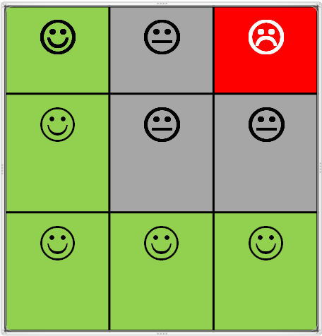

<!-- ```{r include=FALSE} -->
<!-- require(Hmisc) -->
<!-- options(qproject='rms', prType='html') -->
<!-- getRs('reptools.r') -->
<!-- getRs('qbookfun.r') -->
<!-- hookaddcap() -->
<!-- knitr::set_alias(w = 'fig.width', h = 'fig.height', cap = 'fig.cap', scap ='fig.scap') -->
<!-- ``` -->


```{r include=FALSE, eval=TRUE}
require(knitr)
opts_chunk$set(
concordance=FALSE, echo=TRUE, cache=FALSE, warning=FALSE, error=FALSE, message=FALSE)
```

# Introduction

This document contains examples on how to select genes  potentially regulated by methylation and characterized by an L-shaped scatterplot using an heuristic algorithm, implemented in the R `Lheuristic`package.

The idea is to "keep-it-simple" so it can teach potentially users on how to select L-shaped genes started from a pair of matrices, an expression and a methylation matrix, matched by rows (genes) and columns (individuals).

A graphical user interface based in Shiny is also available to use the package.

## Basic pipeline

The basic steps for selecting L-shaped genes using the package is as follows:

1. Input data 
  - Select/Load expression values from a csv file.
  - Select/Load methylation values from a csv file.

2. Prepare data for the analysis
  - Preprocess and normalize each dataset separately as required by the technology used.
  - Format both datasets so taht they match by row names and colum names.
    
3.  Set parameter values
  - For data use. For instance keep only those genes that pass certain filters such as showing negative correlation between expression and methylation.
  - For L-shape selection method
    - Select the methods to be used (naive, negative correlation or L-shape) and the parameters to apply each method.


4. Process data
  - Run the computation and call genes as TRUE or FALSE L-shapes,.
  - Draw the scatterplots of either all genes or only selected genes
  - Compare the output of naive and L-shape methods.

5. Data output (For each method and set of parameters ...)
  - Save (Download) the resulting gene list(s)
  - Save (Download) the scatterplots


```{r directoris, echo=FALSE, eval=TRUE}
options(digits=4)
workingDir <- getwd()
dadesDir <-  file.path(workingDir, "dades")
codeDir <-  file.path(workingDir, "Rcode")
graficsDir<-file.path(workingDir, "results")
resultsDir <- file.path(workingDir, "results")
```


```{r loadpackages, message=FALSE}
if (!(require(VennDiagram))) install.packages("VennDiagram")
if (!(require(org.Hs.eg.db)))
  biocManager::install("org.Hs.eg.db")
if(!(require(Lheuristic)))
  devtools::install_github("aspresearch/Lheuristic", force=TRUE)
library(Lheuristic)
```

# The data for the analysis

## Real datasets

There are several datasets available for analysis obtained from distinct sources:

[Add reference to sources in the bibliography]{.aside}

1. DA1. Expression microarrays (`DAMicroarrays.csv`) and methylation array (`DAMetilacion.csv`) on 25 cell llines.
2. DA2. Expression RNAseq (`DARNAseq.csv`) and methylation array (`DAMetilacion.csv`) on 25 cell llines.
3. GEO1. Expression microarrays (Illumina beadchips, `geoMicroarrays.csv`) and methylation array (Illumina 25kMethArray, `geoMetilacion.csv`) on 25 CRC samples. The data have been collected from the GEO database records: GSE25062 for the methylation data and GSE25070 for the expression data. The dataset has been created by taking the expression values available for 26 CRC tumors and matching with their corresponding methylation values.
4. `TCGA` dataset has been obtained from The Cancer Genome Atlas Database (TCGA) (Colon Adenocarcinoma (`COAD`) Nature 2012 dataset) and downloaded through the cBioportal website.


A summary of each datasets follows below:


```{r readDataDA, eval=TRUE}
require(printr)
DAExprData <- as.matrix(read.table(file=file.path(dadesDir,"DatosMicroarrays.csv"), header=TRUE, sep=";", dec=",", row.names = 1))
DAMetilData <- as.matrix(read.table(file=file.path(dadesDir,"DatosMetilacion.csv"), header=TRUE, sep=";",dec=",", row.names = 1))
#DARNAseqData <- as.matrix(read.table(file=file.path(dadesDir,"DatosRNAseq.csv"), header=TRUE, sep=";",dec=",", row.names = 1))
cat("DA Microarray data : ", dim(DAExprData), "\n")
cat("DA Methylation data: ", dim(DAMetilData), "\n")
# cat("DA RNASeq data     : ", dim(DARNAseqData), "\n")
save(DAExprData, DAMetilData, file="dades/DataMatrices-DA.Rda")
```


```{r readGEOdata, eval=TRUE}
geoExprData <-  as.matrix(read.table(file=file.path(dadesDir,"GEOExpData.csv"), header=TRUE, sep=";", dec="."))
geoMetilData <-  as.matrix(read.table(file=file.path(dadesDir,"GEOMethData.csv"), header=TRUE, sep=";", dec="."))
cat("GEO Microarray data : ", dim(geoExprData), "\n")
cat("GEO Methylation data: ", dim(geoMetilData), "\n")
save(geoExprData, geoMetilData, file="dades/DataMatrices-GEO.Rda")
```


```{r readTCGAdata, eval=TRUE}
TCGAExprData <-  as.matrix(read.table(file=file.path(dadesDir,"TCGA-cBioPortal-Expressions.csv"), header=TRUE, sep=",", dec=".", row.names=1))
TCGAMetilData <-  as.matrix(read.csv(file=file.path(dadesDir,"TCGA-cBioPortal-Methylations.csv"), header=TRUE, sep=",", dec=".", row.names=1))
cat("TCGA Microarray data : ", dim(TCGAExprData), "\n")
cat("TCGA Methylation data: ", dim(TCGAMetilData), "\n")
save(TCGAExprData, TCGAMetilData, file="dades/DataMatrices-TCGA.Rda")
```


```{r inCommon, eval=TRUE}
inCommon<- length(intersect(rownames(DAExprData), rownames(geoExprData)))
inCommon2 <- length(intersect(rownames(DAExprData), rownames(TCGAExprData)))
inCommon3 <- length(intersect(rownames(geoExprData), rownames(TCGAExprData)))
```


There are \Sexpr{inCommon} genes in common between the DAX dataset and the GEO datasets. There are \Sexpr{inCommon2} common genes between the DAX dataset and the TCGA dataset and \Sexpr{inCommon3} common genes between the GEO dataset and the TCGA dataset.

This can be visualized using a Venn diagram

```{r vennCommonGenesin3lists}
myVenn4<- venn.diagram(x=list(DA=rownames(DAExprData),
                              GEO=rownames(geoExprData),
                              TCGA=rownames(TCGAExprData)),
                              filename=NULL, lty = "blank",
                              fill=c("pink1", "skyblue", "mediumorchid"),
                       main="Genes in common between the three datasets")
grid.newpage()
grid.draw(myVenn4)
```


The data for these analyses must have a common structure: **Each pair of matrices (Expression-Methylation) must have the same rome and column names**, that is both datasets must contain information for the same genes and same samples at their corresponding positions.

This can be checked using a simple function such as `checkData` available in the package.

```{r checkData, eval=TRUE}
try(if(!checkPairing(DAExprData, DAMetilData)) stop("Row names and/or column names do not match"))
try(if(!checkPairing(geoExprData, geoMetilData)) stop("Row names and/or column names do not match"))
```


When one is studying the relation between methylation and expression for a bunch of genes it may be convenient to (be able) to plot the scatterplots depicting the relation between these variables. Function `plotGenesMat` allows to draw such plots.

Some examples of using this function with the first four genes of the TCGA dataset are shown below.


```{r plot4Genes1, fig.cap="Scatter plot of first four genes in DA dataset (microarrays)"}
selectedGenes <- c("ALDH1A2", "ALDH1A3", "APCDD1", "ARHGDIB")
opt<- par(mfrow=c(2,2))
plotGenesMat (mets=DAMetilData[selectedGenes, ],
              expres=DAExprData[selectedGenes,], x1=1/3, x2=2/3,
              percY1=1/3, percY2=2/3,
              fileName=NULL, plotGrid = TRUE)
par(opt)
```


```{r plot4Genes3, fig.cap="Scatter plot of first four genes in GEO dataset (microarrays)"}

selectedGenes <- c("ALDH1A2", "ALDH1A3", "APCDD1", "ARHGDIB")
opt<- par(mfrow=c(2,2))
plotGenesMat (mets=geoMetilData[selectedGenes,],
              expres=geoExprData[selectedGenes,],
              x1=1/3, x2=2/3, percY1=1/3, percY2=2/3,
              fileName=NULL, plotGrid = TRUE)
par(opt)
```


```{r plot4Genes4, results='hide', fig.cap="Scatter plot of first four genes in TCGA dataset (microarrays)" }
selectedGenes <- c("ALDH1A2", "ALDH1A3", "APCDD1", "ARHGDIB")
opt<- par(mfrow=c(2,2))
plotGenesMat (mets=TCGAMetilData[selectedGenes,],
              expres=TCGAExprData[selectedGenes,],
              x1=1/3, x2=2/3, percY1=1/3, percY2=2/3,
              fileName=NULL, plotGrid = TRUE)
par(opt)
```


Looking at the figuresabove shows that although the genes may behave similarly  between datasets methods for selecting GRM must be robust and adaptable to for eample distinct sample sizes.


### Gene ZBTB18

Figure  @sec-plotZBTB18 shows how the scatterplot looks like for a gene that has been described bu the researchers as regulated by methylation

```{r plotZBTB18, fig.cap="Scatter plot of gene ZBTB18. It seems clear that this gene will be selected by a method that selects genes negatively correlated rather than *L-shaped*, although the grid could be adequately tuned for selecting it as shown in the plot."}
#selectedGenes <- c("A1BG","A2ML1",  "A4GALT", "AAAS" )
selectedGene <- c("ZBTB18", "ZBTB18")
opt<- par(mfrow=c(2,2))
plotGenesMat (mets=DAMetilData[selectedGene, ],
              expres=DAExprData[selectedGene,], x1=1/3, x2=2/3,
              percY1=1/3, percY2=2/3,
              fileName=NULL, plotGrid = TRUE)
abline( lm(DAExprData["ZBTB18",]~ DAMetilData["ZBTB18", ]))
plotGenesMat (mets=DAMetilData[selectedGene, ],
              expres=DAExprData[selectedGene,], x1=1/3, x2=2/3,
              percY1=1/2, percY2=3/4,
              fileName=NULL, plotGrid = TRUE)
abline( lm(DAExprData["ZBTB18",]~ DAMetilData["ZBTB18", ]))
par(opt)
```


## Artificial TRUE and FALSE L-shaped genes


### Genes extracted from DA dataset

Two small sets of genes^[TRUE and FALSE genes from the original dataset " DA" have been obtained by doing an extensive  sampling on the original dataset and selecting genes that _seemed_ to have an L-shape and those that did not] have been compiled with genes that were clearly L-shaped or clearly non-L-Shaped. Because these sets have been prepared arbitrarily we decide not to use them as "TRUE POSITIVE" and "TRUE NEGATIVES" except for illustrative purposes.


```{r trueOrfalseLgenes1, eval=TRUE}
## Genes True i False
trueLGeneDF <-read.table(file.path(dadesDir, "genesTrueLNEW.txt"))
(trueLGeneNames <- as.character(trueLGeneDF[,1]))
falseLGeneDF <- read.table(file.path(dadesDir, "genesFalseLNEW.txt"))
(falseLGeneNames <- as.character(falseLGeneDF[,1]))

trueLExpr <- DAExprData[rownames(DAExprData) %in% trueLGeneNames ,]
falseLExpr <- DAExprData[rownames(DAExprData) %in% falseLGeneNames ,]
trueLMet <- DAMetilData[rownames(DAMetilData) %in% trueLGeneNames ,]
falseLMet <- DAMetilData[rownames(DAMetilData) %in% falseLGeneNames ,]
if(!(file.exists("DATrueLExpression.csv")))
    write.table(trueLExpr, file.path(dadesDir, "DATrueLExpression.csv"),
                sep=";", dec=".", quote=FALSE)
if(!(file.exists("DATrueLMetilacion.csv")))
    write.table(trueLMet, file.path(dadesDir, "DATrueLMetilacion.csv"),
                sep=";", dec=".", quote=FALSE)
    # tt<- read.table(file.path(dadesDir, "DATrueLMetilacion.csv"), sep=";", dec=".")
```


Figures  @sec-Lshaped1 and  @sec-Lshaped2 show the first four genes of each type for illustrative purposes.

\begin{figure} <!-- ?--->
\centering

```{r plotTRUE1, fig.cap="Example of 'True' L-shaped genes"}
opt<- par(mfrow=c(2,2))
plotGenesMat (mets=trueLMet[1:4,], expres=trueLExpr[1:4,],
              x1=1/3, x2=2/3, percY1=1/3, percY2=2/3,
              fileName=NULL, plotGrid = TRUE)
par(opt)
```

\caption{ {#sec-Lshaped1}}
\end{figure}opt<- par(mfrow=c(2,2)) <!-- ?--->


```{r plotFALSE1, fig.cap="Example of True 'NON-L-shaped'  genes"}
opt<- par(mfrow=c(2,2))
plotGenesMat (mets=falseLMet[1:4,], expres=falseLExpr[1:4,],
              x1=1/3, x2=2/3, percY1=1/3, percY2=2/3,
               fileName=NULL, plotGrid = TRUE)
par(opt)
```


### GEO's TRUE and FALSE L-shaped genes list

Similarly to what we have done with the researcher's dataset we have **visually** selected a set of L-shaped genes Two small sets of genes have been compiled with genes that were clearly L-shaped or clearly non-L-Shaped. Because these sets have been prepared arbitrarily we decide not to use them as "TRUE POSITIVE" and "TRUE NEGATIVES" except for illustrative purposes.


```{r trueOrfalseLgenes2, eval=TRUE}
## Genes True i False
GEOTrueFalse <- read.table(file.path(dadesDir, "GEOTrueFalse.txt"))
(GEOtrueLGeneNames <- as.character(GEOTrueFalse[GEOTrueFalse[,2]!=0,1]))
(GEOfalseLGeneNames <- as.character(GEOTrueFalse[GEOTrueFalse[,2]==0,1]))
GEOtrueLExpr <- geoExprData[rownames(geoExprData) %in% GEOtrueLGeneNames ,]
GEOfalseLExpr <- geoExprData[rownames(geoExprData) %in% GEOfalseLGeneNames ,]
GEOtrueLMet <- geoMetilData[rownames(geoMetilData) %in% GEOtrueLGeneNames ,]
GEOfalseLMet <- geoMetilData[rownames(geoMetilData) %in% GEOfalseLGeneNames ,]
GEOTrueFalseExpr <- geoExprData[rownames(geoExprData) %in% c(GEOtrueLGeneNames,GEOfalseLGeneNames) ,]
GEOTrueFalseMet <- geoMetilData[rownames(geoMetilData) %in% c(GEOtrueLGeneNames,GEOfalseLGeneNames) ,]
if(!(file.exists("GEOTrueLExpression.csv")))
    write.table(GEOtrueLExpr, file.path(dadesDir, "GEOTrueLExpression.csv"),
                sep=";", dec=".", quote=FALSE)
if(!(file.exists("GEOTrueLMetilacion.csv")))
    write.table(GEOtrueLMet, file.path(dadesDir, "GEOTrueLMetilacion.csv"),
                sep=";", dec=".", quote=FALSE)
    # tt<- read.table(file.path(dadesDir, "GEOTrueLMetilacion.csv"), sep=";", dec="."); head(tt)

```


Figures  @sec-GEOLshaped1 and  @sec-GEOLshaped2 show the first four genes of each type for illustrative purposes.

```{r plotTRUE2, fig.cap="Example of 'True' L-shaped genes"}
opt<- par(mfrow=c(2,2))
plotGenesMat (mets=GEOtrueLMet[1:4,], expres=GEOtrueLExpr[1:4,],
               fileName=NULL, plotGrid = TRUE)
par(opt)
```


```{r plotFALSE2, fig.cap="Example of 'True' NON-L-shaped genes"}
opt<- par(mfrow=c(2,2))
plotGenesMat (mets=GEOfalseLMet[1:4,], expres=GEOfalseLExpr[1:4,],
              x1=1/3, x2=2/3, y1=y1, y2=y2,
               fileName=NULL, plotGrid = TRUE)
par(opt)
```


# Scoring scatterplots


## The "three band rule"

After trying different approaches to detect L-shapes, one often comes back to a naive approach like _"L-shaped" genes should show an L shape in the scatterplot, that is, values should tend to be scattered near the vertical and horizontal axes, and the more we move from these positions the least L-shaped the gene should be_.

This idea can be made more explicit by introducing a "three-band rule" as follows:

1. Overimpose a $3\times 3$ grid on the scatterplot. 
1. Classify the scatterplot as **"L" or "non-L"** based on a small set of conditions:

       i) There must be a _minimum_ number of points in the upper-left (cell (1,1)) and lower right (cell (3,3)) corners of the grid.
       i) There must be a _maximum_ number of points in the upper right (cell (1,3)) because points there mean hypermethylation and hyperexpression which is the opposite of what we are looking for.
       i) We will usually _not require to have a minimum of points in cell (3,1)_ unless we are really willing to have an L-shape (in our setting we will also be happy tho recover diagonals, which also reflect a negative correlation!).


1. Score points on each subgrid in such a way that

       i) Points in permitted regions (left-outer margin, i.e. cells: (1,1), (2,2), (3,1), (3,2), (3,3)) score positively if the scatterplot has been classified as L or zero if it has been classified as non-L.
       i) Points in non-desired regions (outer band. i.e. cells (1,2), (1,3), (2,3)) score negatively in all cases.
       i) Some regions may be declared neutral and not-score, such as cell (2,2).

1. Use cross-validation to tune scoring parameters (**if a set of positive and negative L-shaped genes is available**).


The previous scheme can be summarized using the following equation.
$$
S(X) = W_L \circ X \times \mathbbm{1}_L(X) + W_{L^C} \circ X \times \mathbbm{1}_{L^c}(X),
$$
where

* ${X}$ is the matrix of _counts_, i.e. the number of counts in each cell of the grid, 
* ${W_L}$ is the matrix of scores per cell and point _if the scatterplot has been classified as $L$_,
* ${W_{L^c}}$ is the matrix of scores per cell and point _if the scatterplot has been classified as non-$L$ ($L^c$)_,

and $\circ$ represents the hadamard product of the two matrices $W_{L/L^c}$ (i.e. elementwise multiplication of the two matrices) and $\mathbbm{1}_{L/L^c}()$ is the indicator function for $L$ or $L^c$.

The fact that the scatterplot is assigned to $L$ or $L^c$ can also be described as the hadamard product of three matrices:
$$
\mathbold{1}_L(X) = \bigwedge_{i,j} X \circ C \circ \left( mMP \times \sum_{i,j}x_{ij}\right),
$$
where:

* ${X}$ is the matrix of _counts_, i.e. the number of counts in each cell of the grid, 
* $C$ is the matrix of conditions to be verified _if the scatterplot has to be classified as $L$_,
* $mMP$ is the matrix of minimum and Maximum Percentages of points to have in each cell _if the scatterplot has to be classified as $L$_,
* $\circ$ represents the pointwise logical operation which allows that the product of the three cells becomes a logical operation and
* $\bigwedge_{i,j}$ represents an logical "AND" operation of all cells, that is if all cells are TRUE the result is assigned to $L$ and if one fails it is assigned to $L^c$.


This idea is summarized in figure  @sec-Lscore

```{r, out.width="50%", fig.cap="The heuristic method is based in scoring differently depending on where the points are found on a grid"}

```


## Computing on a grid

We have developed several functions to help detect and select L--shape scatterplots.
Their use is described in the package help but they are illustrated here to clarify the code below.


* `calcFreqs` counts the number of points in each cell of the grid for given vertical (defined by parameters `x1`, `x2`) and horizontal lines (defined by parameters `y1`, `y2`, `percY1`, `percY2`) 
* `binScore` classifies (_scores binarily_) a scatterplot based on the rules described above, that is it checks if the minimal assumptions for an L-shape hold or not. It needs a matrix of _min-max frequency counts_.
* `numScore` scores a scatterplot using a matrix of weights that defines the score given to each point depending on the cell where it is located.
    + If the scatterplot has been classified as having L-shape all points are scored, those in favorable regions score positively and those in non-favorable regions negatively.
    + If the scatterplot has not been classifed as "L" only points in non-favourable regions score negatively.

* `scoreGenesMat` is a wrapper for scoring the genes provided in two related matrices that is, it first applies the `binScore` function and depending on its results it computes the `numericScore` function with all the genes in the (pair of) matrices.
* Function `plotGenesMat` is not a computing function but it is worth to enumerate it here because it complements the other functions by allowing to visualize the data that have generated a certain score from a given scatterplot.


## Examples


### Scoring the TRUE/FALSE DA dataset

The first example below show that genes that have been marked as TRUE or FALSE L in the DA dataset **may** score different.


```{r testScoreGenes1TRUE, eval=TRUE}
xVecTrue<- as.numeric(trueLMet[1,])
yVecTrue<- as.numeric(trueLExpr[1,])
reqPercentages <- matrix (c(10, 20, 0, 5, 0, 20, 0, 5, 5), nrow=3, byrow=TRUE)

messageTitle("Frequency count in first 'TRUE' gene")
(geneGridTrue <- calcFreqs(xMet=xVecTrue, yExp=yVecTrue, x1=1/3, x2=2/3,
                          y1=NULL, y2=NULL, percY1=1/3, percY2=2/3))
(maxminCountsT <- toReqMat (sum(geneGridTrue), reqPercentages))
(aWeightMifL=matrix (c(2,-2,-25,1,0,-2,1,1,2), nrow=3, byrow=TRUE))
(aWeightMifNonL=matrix (c(0,-2,-25,0,0,-2,0,0,0), nrow=3, byrow=TRUE))

messageTitle("Binary and numeric soring in first 'TRUE' gene")
(binSc<- binScore (geneGridTrue, maxminCountsT ))
(nsT<- numScore(geneGridTrue, LShaped = binSc, aWeightMifL, aWeightMifNonL))
```


```{r testScoreGenes1FALSE, eval=TRUE}
xVecFalse<- as.numeric(falseLMet[1,])
yVecFalse<- as.numeric(falseLExpr[1,])

messageTitle("Frequency count in first 'FALSE' gene")
(geneGridFalse <- calcFreqs(xMet=xVecFalse, yExp=yVecFalse, x1=1/3, x2=2/3,
                          y1=NULL, y2=NULL, percY1=1/3, percY2=2/3))
(maxminCountsF <- toReqMat (sum(geneGridFalse), reqPercentages))
# Same value as maxminCountsT because it depends only on required percentages and sample size
messageTitle("Binary and numeric soring in first 'FALSE' gene")
(binSc<-binScore (geneGridFalse, maxminCountsF))
(nsF<- numScore(geneGridFalse, LShaped = binSc, aWeightMifL, aWeightMifNonL))
```


```{r testScoreGenes2a, echo=FALSE, eval=TRUE}
messageTitle("Scoring TRUE L-genes in the toy example dataset")
sampleSize <- dim(trueLMet)[2]
(thisWeightMifL=matrix (c(2,-2,-sampleSize,1,0,-2,1,1,2), nrow=3, byrow=TRUE))
(thisWeightMifNonL=matrix (c(0,-2,-sampleSize,0,0,-2,0,0,0), nrow=3, byrow=TRUE))
(reqPercentages <- matrix (c(10, 20, 0, 10, 0, 20, 20, 10, 10), nrow=3, byrow=TRUE))
scoresTrue <- scoreGenesMat (mets=trueLMet, expres=trueLExpr,
                              aReqPercentsMat=reqPercentages,
                              aWeightMifL=thisWeightMifL,
                              aWeightMifNonL=thisWeightMifNonL )
cat("Number of scatterplots scored  : ", dim(scoresTrue)[1],"\n")
cat("Number of L-shape scatterplots : ", sum(scoresTrue[,1]),"\n")
table(scoresTrue[,1])
table(scoresTrue[,2])
```


```{r testScoreGenes2b, echo=FALSE, eval=TRUE}
messageTitle("Scoring FALSE L-genes in the toy example dataset")
sampleSize <- dim(falseLMet)[2]
scoresFalse<- scoreGenesMat (mets=falseLMet, expres=falseLExpr,
                             aReqPercentsMat=reqPercentages,
                             aWeightMifL=thisWeightMifL,
                             aWeightMifNonL=thisWeightMifNonL )
cat("Number of scatterplots scored  : ", dim(scoresFalse)[1],"\n")
cat("Number of L-shape scatterplots : ", sum(scoresFalse[,1]),"\n")
table(scoresFalse[,1])
table(scoresFalse[,2])
```


# Putting all together: Selecting L-shaped genes

The goal of developing all these functions is being able to select L-shaped genes from a paired dataset (expression-methylation) in a way that is as flexible and as rapid and as good as possible.

Essentially the process of selecting L-shape genes consists of three steps:

1. Select datasets (a pair of row-column matched matrices, one for expression and one for methylation). 
2. Set parameters:
  
  i) Grid definition
  ii) Binary Scoring
  ilii) Numerical Scoring

3. Score the selected data and return classificaation (scores and group) and plots for each gene.


## Parameters selection

As it has been shown in the examples above the functions
may be applied sequentially to an expression-methylation pair using the
`scoreGenesMat` function.

We have selected a different set of parameters for DA and GEO datasets than for TCGA data, because as the sample size increases it seems reasonable (necessary) to be mor permisive. Strictly speaking only required percentages have been changed, not weights.


### Parameters for DA and GEO datasets (small samples)

```{r setParameters4DAandGEO}
(reqPercentages   <- matrix (c(10, 20, 1, 4, 30, 20, 0, 5, 10), nrow=3, byrow=TRUE))

(maxminCounts <- toReqMat(dim(DAMetilData)[2], reqPercentages)) # Informative. NOt used in calculations because it is computed within the loop

(theWeightMifL=matrix (c(2,-2,-25,1,0,-2,1,1,2), nrow=3, byrow=TRUE))
(theWeightMifNonL=matrix (c(0,-2,-25,0,0,-2,0,0,0), nrow=3, byrow=TRUE))
```


### Parameters for TCGA datasets (big samples)

```{r setParameters4TCGA}
(reqPercentages4TCGA <- matrix (c(4, 20, 5, 1, 40, 20, 0, 1, 4), nrow=3, byrow=TRUE))

(maxminCounts4TCGA <- toReqMat(dim(TCGAMetilData)[2], reqPercentages4TCGA))

(theWeightMifL=matrix (c(2,-2,-25,1,0,-2,1,1,2), nrow=3, byrow=TRUE))
(theWeightMifNonL=matrix (c(0,-2,-25,0,0,-2,0,0,0), nrow=3, byrow=TRUE))
```


## Scoring datasets

Once the parameters have been set we can proceed to score and classify each dataset.


```{r selectLGenesFromAllDA1, eval=TRUE}
sampleSize <- dim(DAMetilData)[2]
numGenes <-   dim(DAMetilData)[1]

messageTitle("Scoring ALL genes in the DA (microarrays) dataset")

scoresDA1 <- scoreGenesMat (mets=DAMetilData[1:numGenes,],
							expres=DAExprData[1:numGenes,],
                            aReqPercentsMat=reqPercentages,
                            aWeightMifL=theWeightMifL,
                            aWeightMifNonL=theWeightMifNonL )
cat("Number of scatterplots scored  : ", dim(scoresDA1)[1],"\n")
cat("Number of L-shape scatterplots : ", sum(scoresDA1[,1]),"\n")
head(scoresDA1)
table(scoresDA1[,1])
```


```{r selectLGenesFromAllGEO, eval=TRUE}
messageTitle("Scoring ALL genes in the GEO dataset")
sampleSize <- dim(geoMetilData)[2]
numGenes <-   dim(geoMetilData)[1]

scoresGEO <- scoreGenesMat (mets=geoMetilData[1:numGenes,],
                            expres=geoExprData[1:numGenes,],
                            aReqPercentsMat=reqPercentages,
                            aWeightMifL=theWeightMifL,
                            aWeightMifNonL=theWeightMifNonL )
cat("Number of scatterplots scored  : ", dim(scoresGEO)[1], "\n")
cat("Number of L-shape scatterplots : ", sum(scoresGEO[,1]), "\n")
table(scoresGEO[,1])
```


```{r selectLGenesFromAllTCGA, eval=TRUE}
(sampleSize <- dim(TCGAMetilData)[2])
(numGenes <-   dim(TCGAMetilData)[1])
theGenes <- 1:numGenes
reqPercentages <- matrix (c(5, 20, 5, 5, 30, 20, 0, 5, 10), nrow=3, byrow=TRUE)
(maxminCounts <- toReqMat(sampleSize, reqPercentages))

(theWeightMifL=matrix (c(2,-2,-sampleSize/5,1,0,-2,1,1,2), nrow=3, byrow=TRUE))
(theWeightMifNonL=matrix (c(0,-2,-sampleSize/5,0,0,-2,0,0,0), nrow=3, byrow=TRUE))

 messageTitle("Scoring ALL genes in the TCGA (microarrays) dataset")

# theGenes <- c("ALDH1A2", "ALDH1A3", "APCDD1", "ARHGDIB", "ARHGDIG", "APC")
scoresTCGA <- scoreGenesMat (mets=TCGAMetilData[theGenes,],
							              expres=TCGAExprData[theGenes,],
							               x1=1/3, x2=2/3,
                            aReqPercentsMat=reqPercentages,
                            aWeightMifL=theWeightMifL,
                            aWeightMifNonL=theWeightMifNonL )
cat("Number of scatterplots scored  : ", dim(scoresTCGA)[1],"\n")
cat("Number of L-shape scatterplots : ", sum(scoresTCGA[,1]),"\n")
head(scoresTCGA)
table(scoresTCGA[,1])
```


We may use the scores obtained to sort genes from ``most" to ``least" L-shaped.


```{r sortGenes}
orderDA1<- order(scoresDA1[,1], scoresDA1[,2], rownames(scoresDA1),
                 method="radix", decreasing=c(TRUE, TRUE, FALSE))
orderGEO<- order(scoresGEO[,1], scoresGEO[,2], rownames(scoresGEO),
                 method="radix", decreasing=c(TRUE, TRUE, FALSE))
orderTCGA<- order(scoresTCGA[,1], scoresTCGA[,2], rownames(scoresTCGA),
                 method="radix", decreasing=c(TRUE, TRUE, FALSE))
```

We can now use this ordering to plot all genes starting by those that we consider L-shaped. The resulting plots are available in files

* `DAExprAllScores.pdf` 
* `GEOLGenesScores.pdf`
* `TCGAGenesScores.pdf`


```{r plotALlGEnes}
plotGenesMat (mets=DAMetilData[orderDA1,],
              expres=DAExprData[orderDA1,],
              fileName ="DAExprAllScores.pdf",
              text4Title = scoresDA1[orderDA1,"numericSc"])
plotGenesMat (mets=geoMetilData[orderGEO,],
              expres=geoExprData[orderGEO,],
              fileName ="GEOLGenesScores.pdf",
              text4Title = scoresGEO[orderGEO,"numericSc"])
plotGenesMat (mets=TCGAMetilData[orderTCGA,],
              expres=TCGAExprData[orderTCGA,],
              fileName ="TCGALGenesScores.pdf",
              text4Title = scoresTCGA[orderTCGA,"numericSc"])

```


Alternatively instead of plotting all genes we may select L genes and plot only these.
The resulting plots are avilable in files

* `DAExprLGenesScores.pdf` 
* `DARNAseqLGenesScores.pdf`


```{r selectLGenes1, eval=TRUE}
LgenesDAExpr <- DAExprData[scoresDA1[,"logicSc"],]
dim(LgenesDAExpr)
geneListLDAExpr <- rownames(DAExprData[scoresDA1[,"logicSc"],])
plotGenesMat (mets=DAMetilData[geneListLDAExpr,],
              expres=DAExprData[geneListLDAExpr,],
              fileName ="DAExprLGenesScores.pdf",
              text4Title = scoresDA1[geneListLDAExpr,"numericSc"])
LgenesGEOExpr <- geoExprData[scoresGEO[,"logicSc"],]
dim(LgenesGEOExpr)
geneListLGEOExpr <- rownames(geoExprData[scoresGEO[,"logicSc"],])
plotGenesMat (mets=geoMetilData[geneListLGEOExpr,],
              expres=geoExprData[geneListLGEOExpr,],
              fileName ="geoExprLGenesScores.pdf",
              text4Title = scoresGEO[geneListLGEOExpr,"numericSc"])

LgenesTCGA <- TCGAExprData[scoresTCGA[,"logicSc"],]
dim(LgenesTCGA)
geneListLTCGA <- rownames(TCGAExprData[scoresTCGA[,"logicSc"],])
plotGenesMat (mets=TCGAMetilData[geneListLTCGA,],
              expres=TCGAExprData[geneListLTCGA,],
              fileName ="TCGALGenesScores.pdf",
              text4Title = scoresTCGA[geneListLTCGA,"numericSc"])

save(geneListLDAExpr, geneListLGEOExpr,  geneListLTCGA,
     file=file.path(resultsDir, "geneListsL1.RData"))

myVenn4<- venn.diagram(x=list(DAMicroarrays=geneListLDAExpr,
                              GEOData=geneListLGEOExpr,
                              TCGAData=geneListLTCGA),
                              filename=NULL, lty = "blank",
                              fill=c("skyblue", "red", "yellow"))
grid.draw(myVenn4)
```


Or it can be applied to a pre-filtered subset, such as genes showing a significantly negative correlation.


# References

